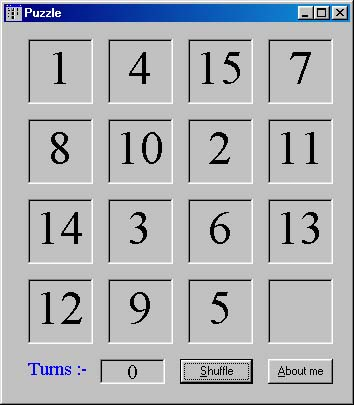

## ^That Old Puzzle Game^

### Description

This a old puzzle game. You will know what to do when you see it. Anyway, arrange the numbers from 1 to 15 starting from upperleft corner. The code is well commented. Has a shuffle option.
 
### More Info
 

             |
---                |---
**Submitted On**   |2002-08-05 13:33:42
**By**             |[Niloy Mondal](https://github.com/Planet-Source-Code/PSCIndex/blob/master/ByAuthor/niloy-mondal.md)
**Level**          |Beginner
**User Rating**    |4.3 (13 globes from 3 users)
**Compatibility**  |VB 5\.0, VB 6\.0
**Category**       |[Games](https://github.com/Planet-Source-Code/PSCIndex/blob/master/ByCategory/games__1-38.md)
**World**          |[Visual Basic](https://github.com/Planet-Source-Code/PSCIndex/blob/master/ByWorld/visual-basic.md)
**Archive File**   |[^That\_Old\_114466852002\.zip](https://github.com/Planet-Source-Code/niloy-mondal-that-old-puzzle-game__1-37637/archive/master.zip)

